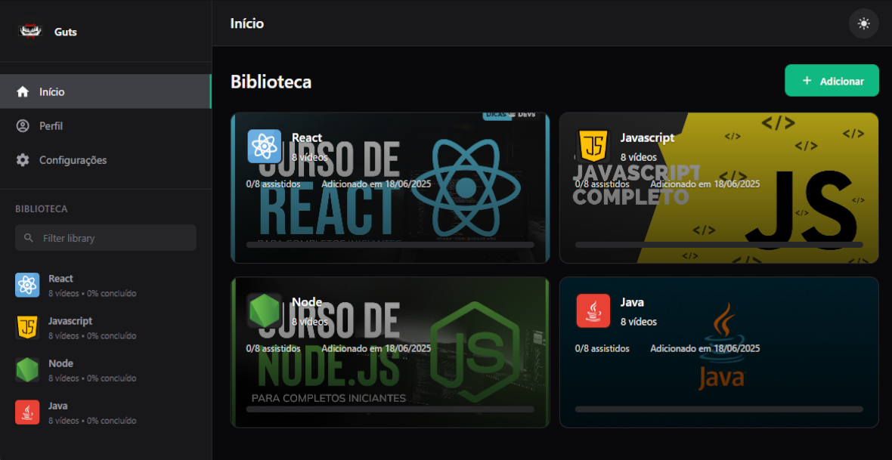
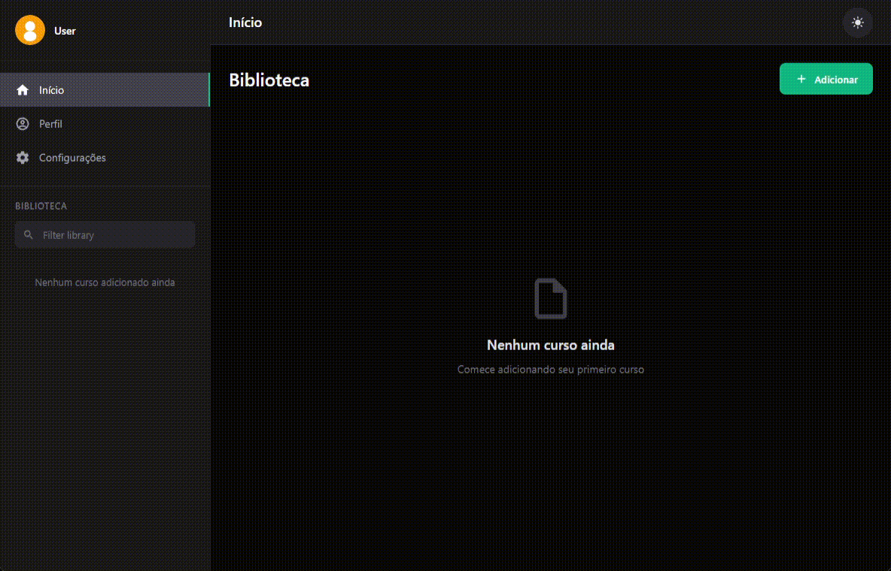
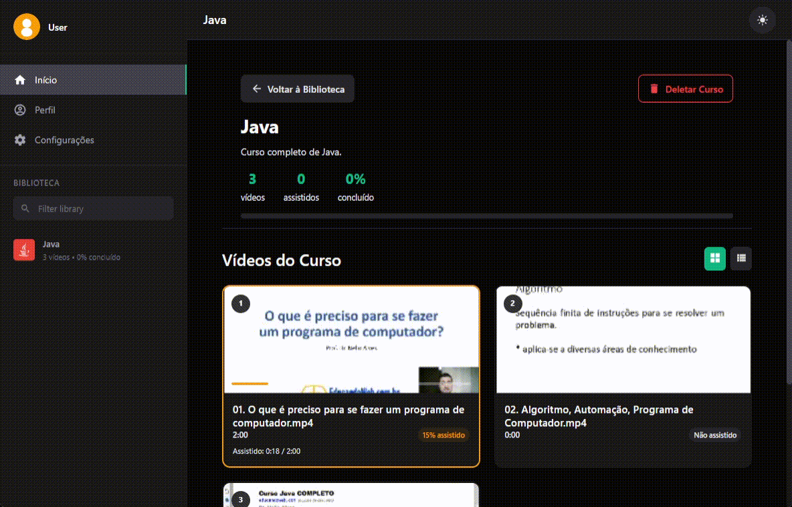
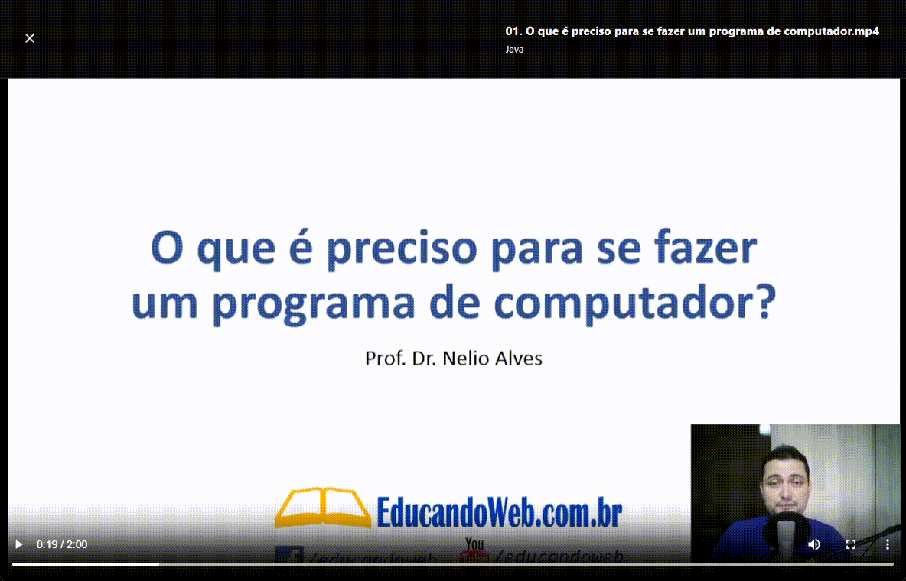
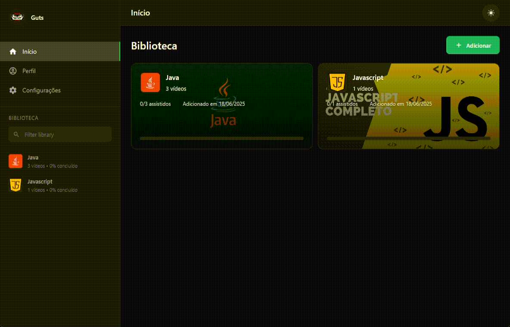

<div align="center">
  
  
  # Robingood
  
  ---
  
  **Uma aplicação gratuita para organizar seus cursos e aulas em vídeo**
  
  
  
</div>

## Funcionalidades

### **Gerenciamento de Cursos**
- Adicione cursos selecionando pastas com vídeos
- Organize automaticamente os vídeos por ordem
- Personalize nome e descrição dos cursos
- Visualize estatísticas detalhadas de progresso



### **Player de Vídeo Avançado**
- Player integrado com controles completos
- Ajuste de velocidade de reprodução (0.5x a 2x)
- Navegação entre vídeos com botões anterior/próximo
- Salva automaticamente o progresso de cada vídeo
- Marca vídeos como assistidos automaticamente



### **Playlist Inteligente**
- Playlist lateral com todos os vídeos do curso
- Indicadores visuais de progresso
- Navegação rápida entre vídeos
- Botão para alternar visibilidade da playlist



### **Sistema de Perfil**
- Perfil personalizado com avatar e nome
- Estatísticas em tempo real:
  - Total de cursos
  - Vídeos assistidos
  - Tempo total de estudo
  - Progresso geral
- Avatar customizável (suporte a imagens locais)


### **Temas Personalizáveis**
- Tema escuro (padrão)
- Tema claro



### **Armazenamento Local**
- Dados salvos localmente no navegador
- Progresso persistente entre sessões
- Thumbnails automáticas dos vídeos

## 🚀 **Instalação**

### Executável Portátil (Recomendado)
1. Baixe o arquivo `Robingood.exe`
2. Execute o arquivo (não requer instalação)
3. Comece a organizar seus cursos!

## **Como Usar**

1. **Adicione um curso**: Clique em "Adicionar Curso" e selecione uma pasta com vídeos
2. **Personalize**: Defina nome, descrição e organize seus cursos
3. **Assista**: Use o player integrado com controles avançados
4. **Acompanhe**: Veja seu progresso em tempo real no perfil
5. **Customize**: Ajuste temas e configurações conforme sua preferência

## **Tecnologias**

- **Electron** - Framework para aplicações desktop
- **JavaScript** - Lógica da aplicação
- **HTML5/CSS3** - Interface moderna e responsiva
- **LocalStorage** - Armazenamento persistente de dados

## **Requisitos do Sistema**

- **Windows**: 7 ou superior
- **macOS**: 10.12 ou superior  
- **Linux**: Ubuntu 16.04 ou superior
- **RAM**: 512MB mínimo
- **Espaço**: 100MB livre

## 📄 **Licença**

Este projeto está licenciado sob a Licença MIT - veja o arquivo [LICENSE](LICENSE) para detalhes.

```
MIT License

Copyright (c) 2025 Rodrigo Colissi

Permission is hereby granted, free of charge, to any person obtaining a copy
of this software and associated documentation files (the "Software"), to deal
in the Software without restriction, including without limitation the rights
to use, copy, modify, merge, publish, distribute, sublicense, and/or sell
copies of the Software, and to permit persons to whom the Software is
furnished to do so, subject to the following conditions:

The above copyright notice and this permission notice shall be included in all
copies or substantial portions of the Software.

THE SOFTWARE IS PROVIDED "AS IS", WITHOUT WARRANTY OF ANY KIND, EXPRESS OR
IMPLIED, INCLUDING BUT NOT LIMITED TO THE WARRANTIES OF MERCHANTABILITY,
FITNESS FOR A PARTICULAR PURPOSE AND NONINFRINGEMENT. IN NO EVENT SHALL THE
AUTHORS OR COPYRIGHT HOLDERS BE LIABLE FOR ANY CLAIM, DAMAGES OR OTHER
LIABILITY, WHETHER IN AN ACTION OF CONTRACT, TORT OR OTHERWISE, ARISING FROM,
OUT OF OR IN CONNECTION WITH THE SOFTWARE OR THE USE OR OTHER DEALINGS IN THE
SOFTWARE.
```

---

<div align="center">
  
  **Desenvolvido por [Rodrigo Colissi](https://github.com/rodrigocolissi)**
  
  Se este projeto foi útil para você, considere dar uma estrela!
  
</div>